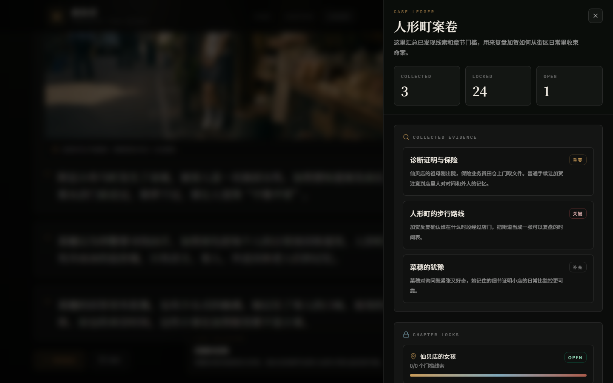

# 新参者 · 沉浸式阅读器

基于东野圭吾《新参者》的沉浸式交互阅读体验，以段落推进、线索收集、案卷整理的方式重现人形町的侦探故事。

## 预览

<table>
  <tr>
    <td align="center"><b>首页</b></td>
    <td align="center"><b>章节选择</b></td>
  </tr>
  <tr>
    <td></td>
    <td></td>
  </tr>
  <tr>
    <td align="center"><b>沉浸阅读</b></td>
    <td align="center"><b>线索收集</b></td>
  </tr>
  <tr>
    <td></td>
    <td></td>
  </tr>
  <tr>
    <td align="center" colspan="2"><b>案卷面板</b></td>
  </tr>
  <tr>
    <td colspan="2" align="center"></td>
  </tr>
</table>

## 功能

- **段落推进式阅读** — 点击"继续推进"逐步展开故事，模拟翻页节奏
- **线索自动收集** — 阅读过程中关键线索自动弹出并归档
- **案卷面板（Ledger）** — 汇总已收集线索，追踪章节解锁进度
- **9 章完整故事** — 从仙贝店到终章，完整还原人形町案件
- **氛围视觉** — 暗色主题 + 场景配图，沉浸感拉满

## 技术栈

- React + TypeScript
- Vite
- Tailwind CSS

## 运行

```bash
npm install
npm run dev
```

## 构建

```bash
npm run build
```
